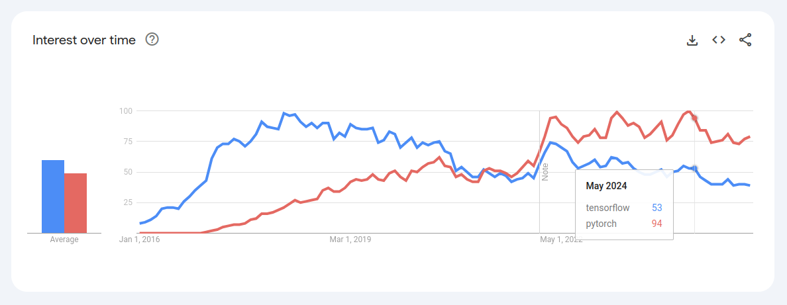
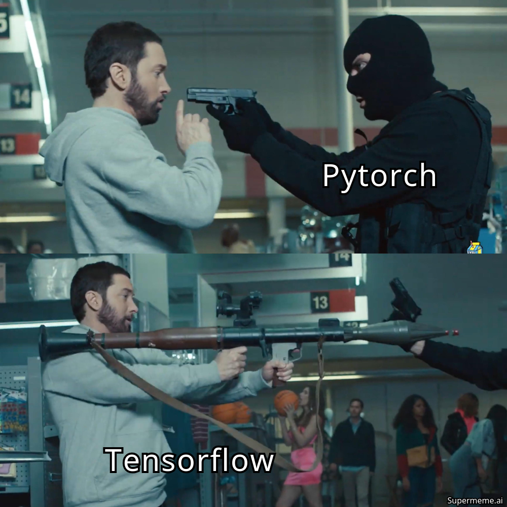
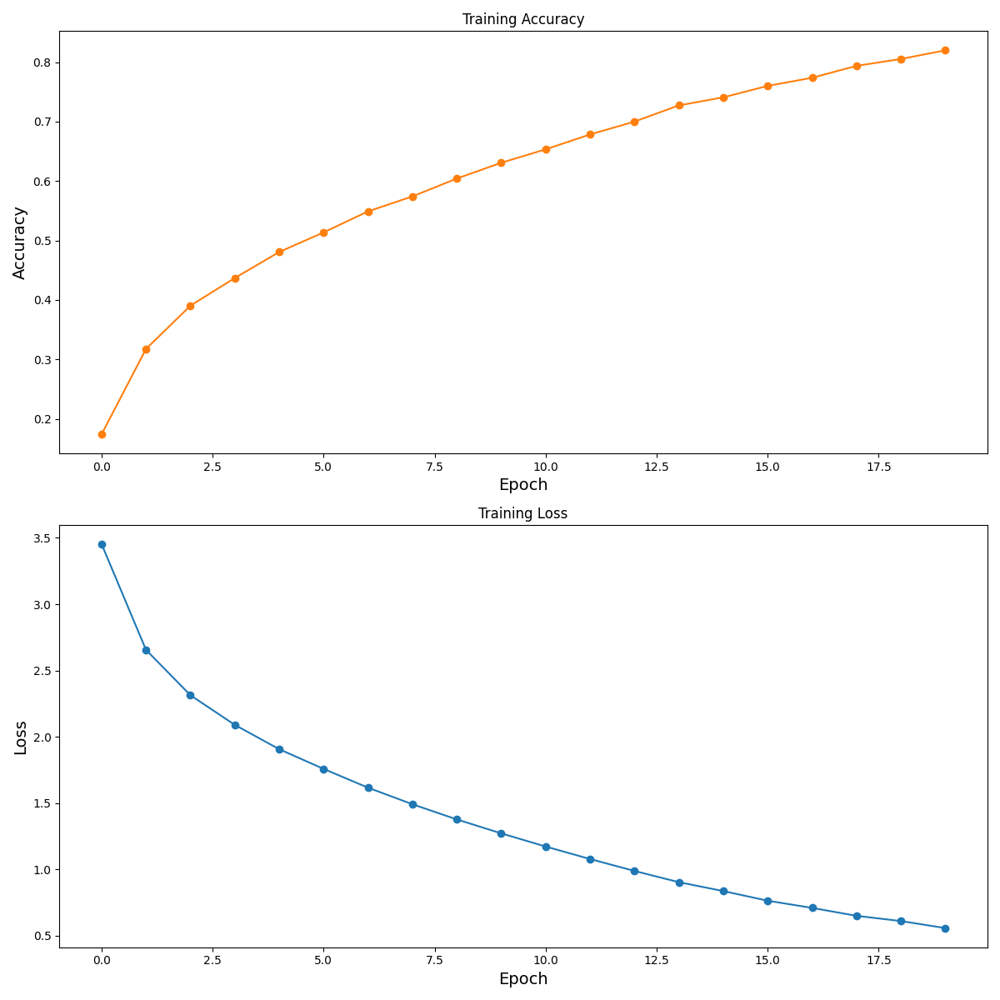

# TensorFlow ⚔️ PyTorch

Both TensorFlow and PyTorch are powerhouses in the deep learning world. Google open-sourced TensorFlow in 2015, and a year later, Facebook (now Meta) dropped PyTorch into the ring in 2016.

🤔 But the million-dollar question is... which one is better?

Well, instead of starting a flame war 🔥, let’s take a look at the adoption trends in the AI community and see where the battle is heading! 📈



In recent years, PyTorch has been on 🔥, especially in the research community! 🚀

**Why PyTorch is Winning Researchers Over:**

1️⃣ More Pythonic & Easy to Use – It feels like writing native Python code, giving developers more control and easier debugging compared to TensorFlow.  
2️⃣ Rapid Prototyping – Researchers love it because they can iterate faster and experiment more freely, which is why so many cutting-edge papers and models are implemented in PyTorch first.

But Wait! TensorFlow Still Packs a Punch 💪

**While PyTorch shines in research, TensorFlow dominates in production:**

1️⃣ Built for Large-Scale Production – Whether it's serving massive models on the cloud with TensorFlow Serving or deploying AI on edge devices with TensorFlow Lite (TFLite), it's the go-to framework for real-world applications.  
2️⃣ Distributed Training Powerhouse – Need to train gigantic models? TensorFlow handles large-scale distributed training like a champ, and it even runs on Google’s TPUs for insane performance boosts. 🚀



PyTorch is the researcher’s best friend, but when it’s time to scale up and go big, TensorFlow still holds the 👑

---
---


## Benchmarking Showdown ⚡

Let's take [CIFAR100](https://www.cs.toronto.edu/~kriz/cifar.html) dataset & compare both of the frameworks accross multiple aspects.

### CIFAR100

This dataset is just like the CIFAR-10, except it has 100 classes containing 600 images each. There are 500 training images and 100 testing images per class. 

Total Training data: 50,000  
Total Testing data: 10,000


Both of the frameworks have APIs to load this dataset:

```python
import tensorflow as tf
import torchvision

# tensorflow
(x_train, y_train), (x_test, y_test) = tf.keras.datasets.cifar100.load_data()

# pytorch
train = torchvision.datasets.CIFAR100(train=True)
test = torchvision.datasets.CIFAR100(train=False)
```

But most of the real world datasets won't fully fit in the memory. So to simulate this scenario, we will upscale the images to 64x64 & save them to disk as jpegs.

Directory Structure
```
cifar100/
├── train
│   ├── 0
|       |-- 1.jpg
|       |-- 2.jpg
│   ├── 1
│   ├── 10
```

These will be then read, preprocessed in dataloading part.

### Reproducibility

To ensure reproducibility, we will set `seed` for these frameworks and other libraries. (ex: numpy, random etc.)

### Dataloaders

#### Tensorflow:

We will be using `tf.data` api to build dataloader with the following operations:  
* Preprocessing  
    * Resizing - 32x32
    * Normalizing
    * Get label from `image_path`
    * One hot encode the label
* Caching
* Augmenting
* Shuffle if train data
* Batching
* Prefetcing
* Repeat if train data

Example:
```python
# train dataloader
dataloader = (
    tf.data.Dataset.from_tensor_slices(paths)
    .map(preprocess, num_parallel_calls=AUTOTUNE)
    .cache()
    .map(augment, num_parallel_calls=AUTOTUNE)
    .shuffle(len(paths))
    .batch(BS)
    .prefetch(AUTOTUNE)
    .repeat()
)
```
YES! It's that easy.

#### Pytorch:

Here we need to do two things, first create a Dataset & then create a Dataloader from it:

To create a Dataset we will be using `torch.utils.data.Dataset` having these steps:

* Read image
* Get label from `image_path`
* Tranform the image
    * Augmenting
    * Resizing
    * Normalizing

Example:

```python
class ClassificationDataset(Dataset):

    def __init__(
        self,
        config: Config,
        paths: list[str],
        transforms=None,
        augmentations=None,
        cache: bool = False,
    ) -> None:
        self.config = config
        self.paths = paths
        self.transforms = transforms
        self.augmentations = augmentations
        self.cache = None
        if cache:
            self.cache = SharedCache(
                size_limit_gib=get_shm_size(),
                dataset_len=len(self.paths),
                data_dims=(self.config.imgsz[-1], *self.config.imgsz[:-1]),
                dtype=torch.float32,
            )

    def __len__(self) -> None:
        return len(self.paths)

    def __getitem__(self, idx: int):
        path = self.paths[idx]
        label = int(path.split(os.path.sep)[-2])
        image = None
        if self.cache:
            image = self.cache.get_slot(idx)
        if image is None:
            image = Image.open(path).convert('RGB')
            if self.transforms:
                image = self.transforms(image)
            if self.cache:
                self.cache.set_slot(idx, image)
        if self.augmentations:
            image = self.augmentations(image)
        return image, label
```

After this we need to build a Dataloader using `torch.utils.data.Dataloader`:

```python
# train dataloader
dataloader = DataLoader(
    dataset=dataset,
    batch_size=sbatch_size,
    shuffle=True,
    num_workers=num_workers,
)
```

### Model

We will be using the same naive 4 layer CNN in both of the frameworks:

```
┏━━━━━━━━━━━━━━━━━━━━━━━━━━━━━━━━━━━━━━┳━━━━━━━━━━━━━━━━━━━━━━━━━━━━━┳━━━━━━━━━━━━━━━━━┓
┃ Layer (type)                         ┃ Output Shape                ┃         Param # ┃
┡━━━━━━━━━━━━━━━━━━━━━━━━━━━━━━━━━━━━━━╇━━━━━━━━━━━━━━━━━━━━━━━━━━━━━╇━━━━━━━━━━━━━━━━━┩
│ conv2d (Conv2D)                      │ (None, 32, 32, 32)          │             896 │
├──────────────────────────────────────┼─────────────────────────────┼─────────────────┤
│ batch_normalization                  │ (None, 32, 32, 32)          │             128 │
│ (BatchNormalization)                 │                             │                 │
├──────────────────────────────────────┼─────────────────────────────┼─────────────────┤
│ re_lu (ReLU)                         │ (None, 32, 32, 32)          │               0 │
├──────────────────────────────────────┼─────────────────────────────┼─────────────────┤
│ max_pooling2d (MaxPooling2D)         │ (None, 16, 16, 32)          │               0 │
├──────────────────────────────────────┼─────────────────────────────┼─────────────────┤
│ conv2d_1 (Conv2D)                    │ (None, 16, 16, 64)          │          18,496 │
├──────────────────────────────────────┼─────────────────────────────┼─────────────────┤
│ batch_normalization_1                │ (None, 16, 16, 64)          │             256 │
│ (BatchNormalization)                 │                             │                 │
├──────────────────────────────────────┼─────────────────────────────┼─────────────────┤
│ re_lu_1 (ReLU)                       │ (None, 16, 16, 64)          │               0 │
├──────────────────────────────────────┼─────────────────────────────┼─────────────────┤
│ max_pooling2d_1 (MaxPooling2D)       │ (None, 8, 8, 64)            │               0 │
├──────────────────────────────────────┼─────────────────────────────┼─────────────────┤
│ conv2d_2 (Conv2D)                    │ (None, 8, 8, 128)           │          73,856 │
├──────────────────────────────────────┼─────────────────────────────┼─────────────────┤
│ batch_normalization_2                │ (None, 8, 8, 128)           │             512 │
│ (BatchNormalization)                 │                             │                 │
├──────────────────────────────────────┼─────────────────────────────┼─────────────────┤
│ re_lu_2 (ReLU)                       │ (None, 8, 8, 128)           │               0 │
├──────────────────────────────────────┼─────────────────────────────┼─────────────────┤
│ max_pooling2d_2 (MaxPooling2D)       │ (None, 4, 4, 128)           │               0 │
├──────────────────────────────────────┼─────────────────────────────┼─────────────────┤
│ conv2d_3 (Conv2D)                    │ (None, 4, 4, 128)           │         147,584 │
├──────────────────────────────────────┼─────────────────────────────┼─────────────────┤
│ batch_normalization_3                │ (None, 4, 4, 128)           │             512 │
│ (BatchNormalization)                 │                             │                 │
├──────────────────────────────────────┼─────────────────────────────┼─────────────────┤
│ re_lu_3 (ReLU)                       │ (None, 4, 4, 128)           │               0 │
├──────────────────────────────────────┼─────────────────────────────┼─────────────────┤
│ max_pooling2d_3 (MaxPooling2D)       │ (None, 2, 2, 128)           │               0 │
├──────────────────────────────────────┼─────────────────────────────┼─────────────────┤
│ global_average_pooling2d             │ (None, 128)                 │               0 │
│ (GlobalAveragePooling2D)             │                             │                 │
├──────────────────────────────────────┼─────────────────────────────┼─────────────────┤
│ dense (Dense)                        │ (None, 128)                 │          16,512 │
├──────────────────────────────────────┼─────────────────────────────┼─────────────────┤
│ dense_1 (Dense)                      │ (None, 100)                 │          12,900 │
└──────────────────────────────────────┴─────────────────────────────┴─────────────────┘
Total params: 271,652 (1.04 MB)
Trainable params: 270,948 (1.03 MB)
Non-trainable params: 704 (2.75 KB)
```

### Optimizer, Loss & Metrics

Optimizer: Adam  
Loss: CrossEntropyLoss  
Metrics: Accuracy  

### Training

Train the model for some epochs & capture the training history (loss and accuracy) for each epoch.

Here is an example history plotted for a run:



### Save the Model

Tensorflow: `.keras`  
Pytorch: torchscript `.pt`

### Evaluation

* Build dataloaders for test dataset & evaluate the trained model.
* Save the results

### Benchmarking Stats

Along with all the above mentioned steps, we will be logging the time taken for each step to execute:

Time taken for:

* Data Loading
* Model Building
* Model Training
* Model Saving
* Model Loading
* Evaluation

---
---

## Benchmarking Results 🎖️

After running with different combinations of training parameters (batch-size, num_workers etc) & devices, here are the results 🥁

### SEED: 25 | Epochs: 20

#### CPU

Name: Intel(R) Core(TM) Ultra 7 155H

Without Augmentations: 
| Framework  | Batch Size | Num Workers | Caching | Training Time | Eval Time |
|------------|------------|------------|---------|---------------|-----------|
| PyTorch    | 32| 0          | False | 1518s        | 11s       |
| TensorFlow 💯  | 32 | NA          | True | 1086s        | 3s       |
| PyTorch    | 32 | 5           | False | 1402s         | 6s      |
| TensorFlow | 32 | NA          | False | 1164s        | 3s       |


With Augmentations:
| Framework  | Batch Size | Num Workers | Caching | Training Time | Eval Time |
|------------|------------|------------|---------|---------------|-----------|
| PyTorch    | 16 | 0          | False | 1741s        | 8s       |
| PyTorch    | 32 | 0          | False | 1589s        | 8s       |
| PyTorch    | 32 | 0          | True | 1217s        | 8s       |
| PyTorch    | 64 | 0          | False | 1443s        | 8s       |
| PyTorch    | 32 | 5          | False | 1420s        | 6s       |
| PyTorch    | 32 | 5          | True | 1301s        | 6s       |
| PyTorch    | 32 | 10          | False | 1407s        | 6s       |
| PyTorch    | 32 | 10          | True | 1305s        | 7s       |
| PyTorch    | 32 | 15          | False | 1361s        | 5s       |
| PyTorch    | 32 | 20          | False | 1404s        | 7s       |
| TensorFlow | 16 | NA          | True | 1419s        | 4s       |
| TensorFlow | 32 | NA          | True | 1151s        | 3s       |
| TensorFlow 💯 | 64 | NA          | True | 1021s        | 2s       |


#### GPU

Name: Tesla T4

With Augmentations:
| Framework  | Batch Size | Num Workers | Caching | Training Time | Eval Time |
|------------|------------|------------|---------|---------------|-----------|
| PyTorch    | 16 | 0          | True | 320s        | 8s       |
| PyTorch    | 32 | 0          | False | 580s        | 4s       |
| PyTorch    | 32 | 0          | True | 201s        | 4s       |
| PyTorch    | 32 | 5          | False | 187s        | 2s       |
| PyTorch    | 32 | 5          | True | 161s        | 2s       |
| PyTorch    | 32 | 10          | False | 192s        | 2s       |
| PyTorch    | 32 | 10          | True | 163s        | 2s       |
| PyTorch    | 32 | 15          | True | 165s        | 2s       |
| PyTorch    | 32 | 20          | True | 168s        | 2s       |
| PyTorch    | 64 | 0          | True | 155s        | 4s       |
| TensorFlow | 16 | NA          | True | 199s        | 3s       |
| TensorFlow | 32 | NA          | False | 143s        | 3s       |
| TensorFlow | 32 | NA          | True | 126s        | 3s       |
| TensorFlow 💯 | 64 | NA          | True | 94s        | 2s       |

### Find the code here - [🚀](https://github.com/infocusp/tf_pt_benchmarking)